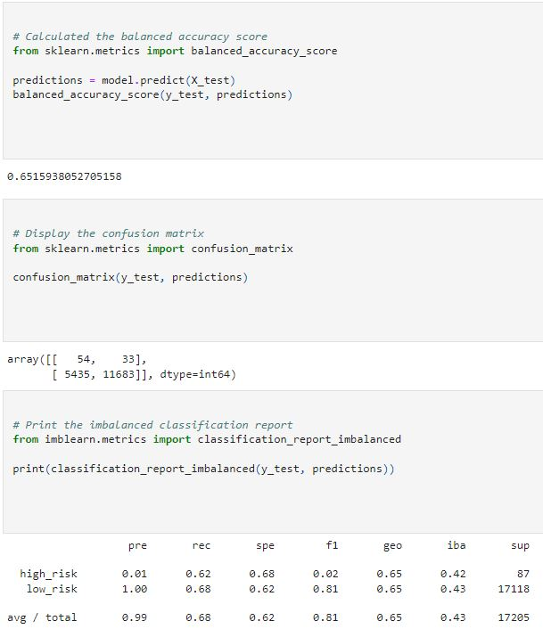
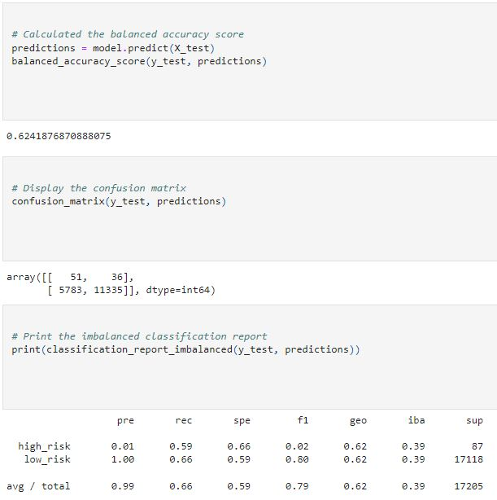
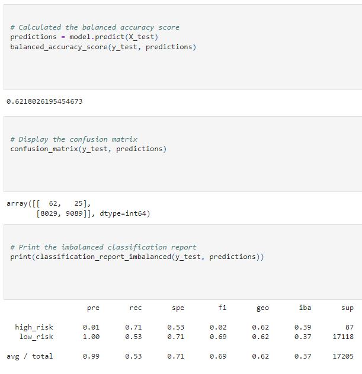
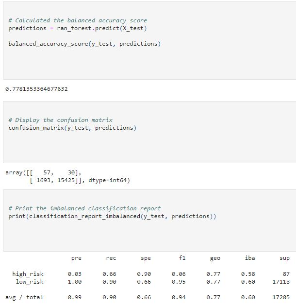

# Credit_Risk_Analysis
## Devin Monsen
### 12/07/2022
---
## Overview of the Analysis ##
---
In this assignment we worked with Jill to calculate credit risk based off customers requesting loans. Using scikit, imbalanced-learn, SMOTE, EasyEnsembleClassifier, RandomOverSampler packages and algorithms just to name of few. We then dove into our csv file, created the features off of customers information. Which set the building blocks for our logistic regression for a supervised machine
---
## Results ##
---
- Random Oversampling: 65% Accuracy, 1% High risk, 68% recall

- 62% Accuracy, 1% High risk, 66% Recall 

- 52% Accuracy, 1% High risk, 47% Recall

- 62% Accuracy, 1% High risk, 53% Recall

- 77% Accuracy, 1% Risk, 90% Recall

- 92% Accuracy, 1% Risk, 94% Recall

---
## Summary ##
---
- 1.After finding our retiring employees by department. A sum of the counts brought us to a total of 90398 employees due to retire.
- 2.Based off of our retiring_titles table we can see that the Senior positions will be well taken care of if we can receive a 10% mentorship rate. However with that same rate on the management and tech positions, then they will not be as well trained. I would break this down more into a table based of departmens and a table for positions specific grouped by department. Hoever I am away from my workstation and dont have access to PGadmin.
