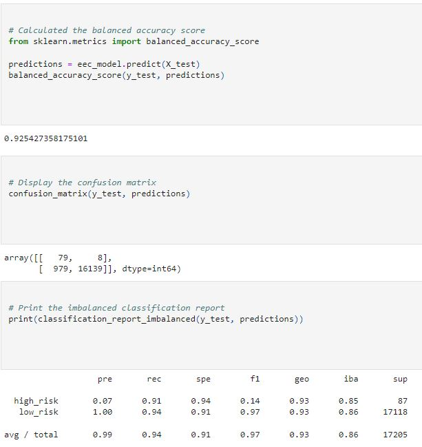

# Credit_Risk_Analysis
## Devin Monsen
### 12/07/2022
---
## Overview of the Analysis ##
---
In this assignment we worked with Jill to calculate credit risk based off customers requesting loans. Using scikit, imbalanced-learn, SMOTE, EasyEnsembleClassifier, RandomOverSampler packages and algorithms just to name of few. We then dove into our csv file, created the features off of customers information. Which set the building blocks for our logistic regression for a supervised machine
---
## Results ##
---
- Random Oversampling: 65% Accuracy, 1% High risk, 68% recall
---

- SMOTE: 62% Accuracy, 1% High risk, 66% Recall 
---

-Undersampling: 52% Accuracy, 1% High risk, 47% Recall
---

- Combination: 62% Accuracy, 1% High risk, 53% Recall
---

- Balanced Random Forest: 77% Accuracy, 1% Risk, 90% Recall
---

- EEC: 92% Accuracy, 1% Risk, 94% Recall
---

---
## Summary ##
---
Random Ovaersampling, SMOTE, Combination and Undersampling all had a relatively low accuracy. Then our Random Forest had a higher accuracy but too high recall. EEC gave us a good balance of both thus making it the most viable model.
