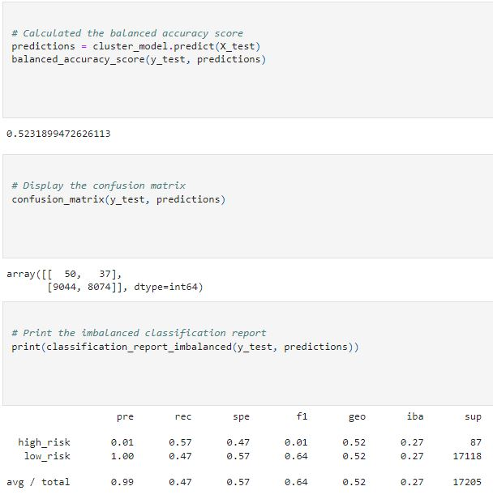

# Credit_Risk_Analysis
## Devin Monsen
### 12/07/2022
---
## Overview of the Analysis ##

In this project my goal was to calculate credit risk based off customers requesting loans. I then dove into the customer data csv file, created the features dataframe off of the csv. Which set the building blocks for the logistic regression for a supervised machine learning model.
---
## Tools For Development

scikit-learn 1.2.1
imbalanced-learn 0.10.1
SMOTE 0.10.1
easyEnsembleClassifier 0.10.1
randomOverSampler 0.10.1

### Code
Jupyter Notebook 6.5.3
Python 3.3
---
## Results ##

- Random Oversampling: 65% Accuracy, 1% High risk, 68% recall
---

- SMOTE: 62% Accuracy, 1% High risk, 66% Recall 
---

-Undersampling: 52% Accuracy, 1% High risk, 47% Recall
---

- Combination: 62% Accuracy, 1% High risk, 53% Recall
---

- Balanced Random Forest: 77% Accuracy, 1% Risk, 90% Recall
---

- EEC: 92% Accuracy, 1% Risk, 94% Recall
---

---
## Summary ##
---
Random Ovaersampling, SMOTE, Combination and Undersampling all had a relatively low accuracy. Then our Random Forest had a higher accuracy but too high recall. EEC gave us a good balance of both thus making it the most viable model.
